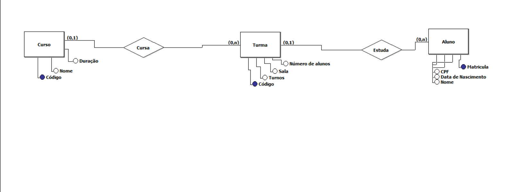

# Módulo 4 – Sistema Resilia
 
<h1> Existem outras entidades além dessas três?</h1>

Sim, existe, por exemplo a entidade professor. Como as entidades são modelos (objetos) da nossa realidade sobre os quais queremos guardar dados, existem varios dados de professor, e nesse caso os dados seriam os atributos, como: CPF, Nome e etc...

<h1>Quais são os principais campos e tipos?</h1>

O campo seria igual ao Atributo, ou seja aquilo que vem dentro da entidade. Por exemplo, existe uma determinada entidade chamada “curso”, entao você pode ter como atributo(campo) o código do curso, o nome. O código é um atributo chave, chave primária(Primary Key), um atributo vira atributo chave, quando ele é algo exclusivo.

Tipo pode ser explicado de uma forma melhor em exemplos: Temos a idade que pode ser int(inteiro), pois pode ser calculada, o dinheiro que pode ser tipo float, pois permite que o formato textual do dinheiro seja aplicado, existe tambem o varchar, que seria o mais aplicado, varchar se aplica a varias situacoes como nome, numero de telefone, celular, cep, cpf, coisas que são variáveis e são do tipo texto

Nesse caso, os principais campos seriam aqueles marcados com a Primary Key, ou seja, no caso do aluno seria o CPF, ja no caso da turmas poderia ser o codigo especifico daquela turma, os cursos tambem podem ter codigos especificos

<h1>Como essas entidades estão relacionadas?</h1>

A turma se relaciona com o curso, o aluno se relaciona a turma, o curso pode ter varias turmas, e a turma pode ter vários alunos. Dessa forma, um curso tem varias turmas, cursos podem formar muitas turmas, enquanto turmas sao formadas por varios alunos. Segue a relacao logica:

<ul>
<li>
<i>(0.1) Curso para turmas, um curso para varias turmas.</i>
</li>
<li>
<i>(0,1) Turma para alunos, vários alunos para cada turma</i>
</li>
</ul>

O MER (Modelo Entidade Relacionamento) ou DER(Diagrama Entidade-Relacionamento) é utilizado para descrever os objetos do mundo real através de entidades, com suas propriedades que são os atributos e os seus relacionamentos. Usamos esses modelos para fazer desenhos que serviram de ponto de partida para identificar os requisitos, montar as entidades, atributos, para assim conseguir criar o banco de dados de forma funcional.

<h1>Pensando em 2 registros para cada entidade</h1> 
<ul>
<li>
Cursos: Nome do curso, poderia ser administração, informática. Outro resgistro poderia ser código do curso criado através do id not_null autoincrement primary_key
</li>
<li>
Turmas: turno que pode ser tarde, noite, manhã e a sala pode ser 04, 02, 05
</li>
<li>
Alunos: Nome que vão ter os registros dos nomes e o cpf que vão ser adicionado os registros dos cpf
</li>
</ul>

<h1>Print do Modelo Proposto</h1>

